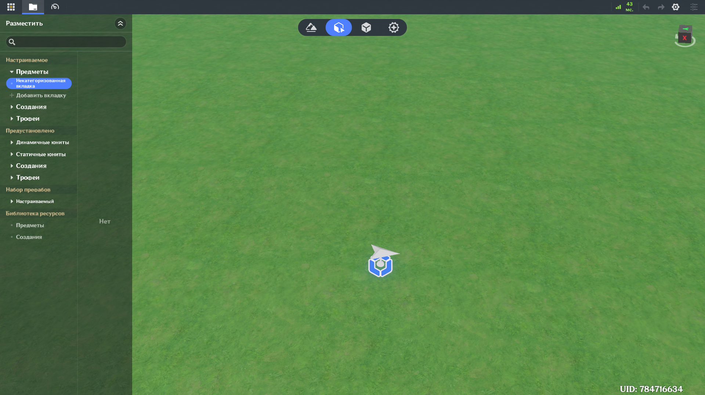
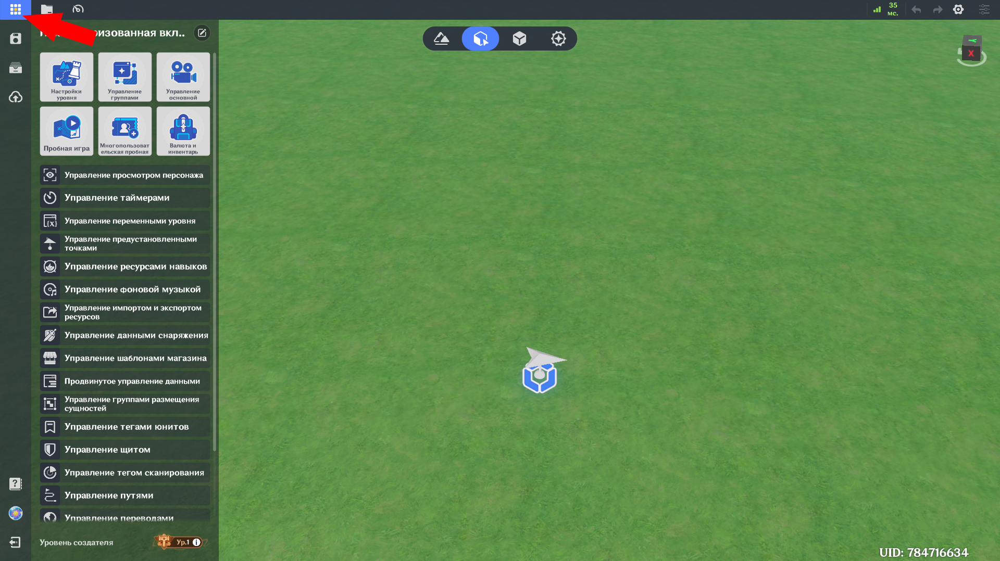
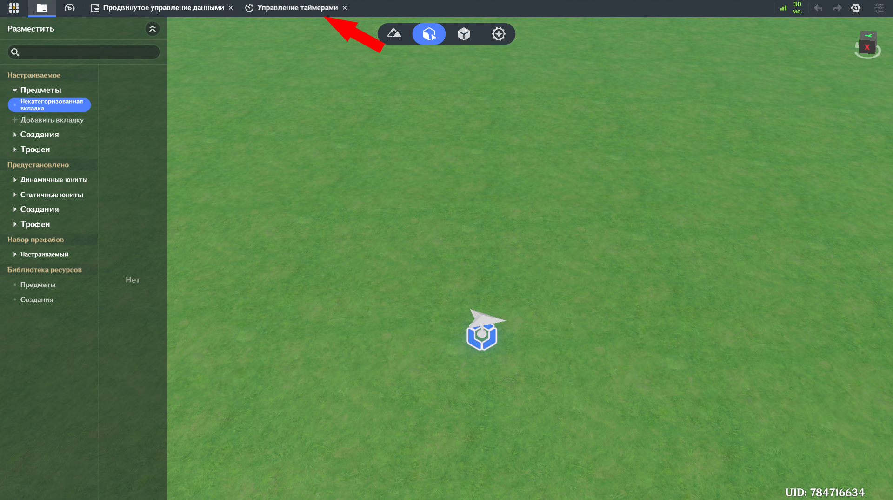
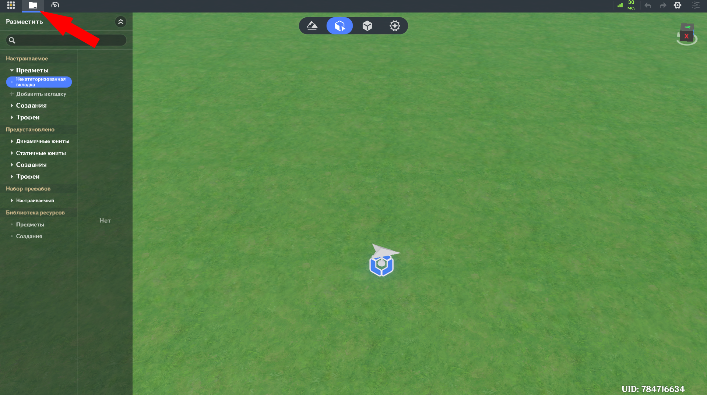
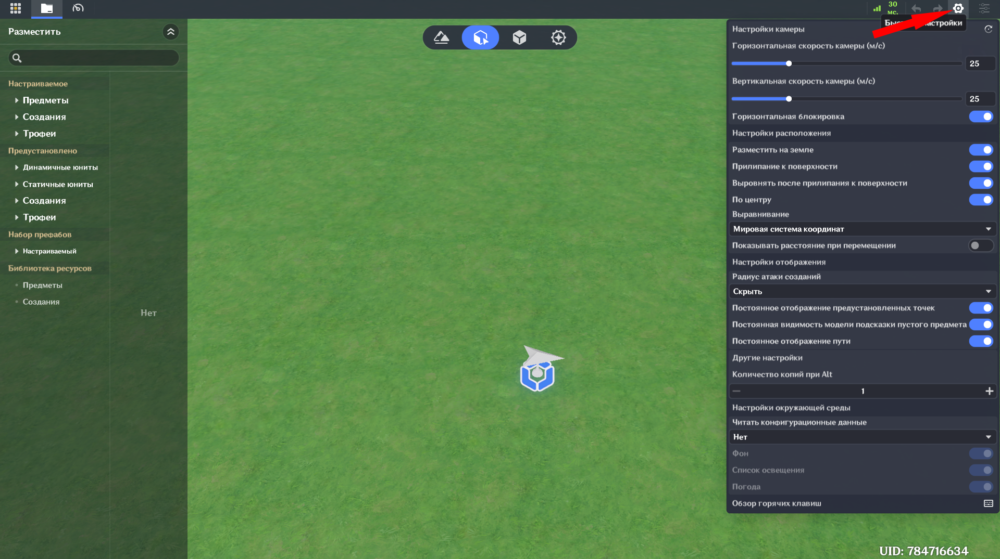
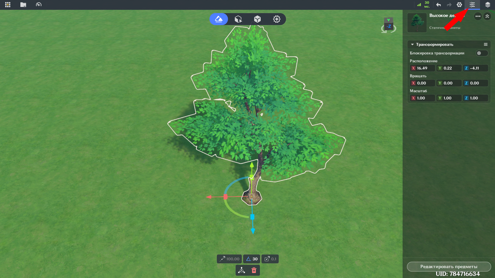
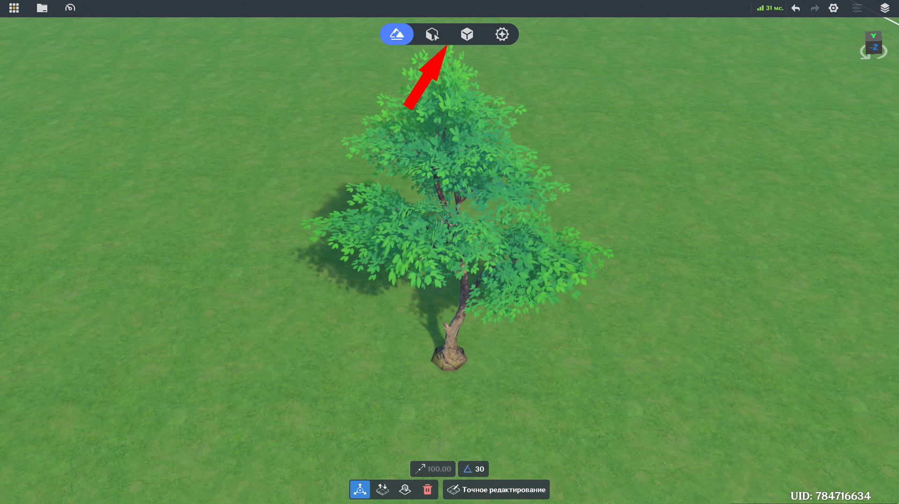

# Рабочая область

## I. Главное меню

Нажмите на иконку в верхнем левом углу рабочей области (как показано на скриншоте), чтобы открыть или закрыть главное меню, или нажмите на Escape.

!!! Note "Использование Escape"
    Клавиша Escape по умолчанию закрывает дополнительные окна и панели, отменяет активные действия (например, переименование элементов) и выводит из режима редактирования (например, редактирования местности), потому вызвать главное меню нажатием на клавишу можно не во всех случаях.

### 1. Функции главного меню

Главное меню предоставляет следующие функции:

  * Быстрое сохранение, управление сохранениями, загрузка уровня на сервер, переход в руководство создателя (новая вкладка в браузере), переход в Miliastra Sandbox, выход из редактора уровней.

  * Настройки уровня, управление группами, управление основной камерой, пробная игра, многопользовательская пробная игра, валюта и инвентарь.

  * Управление просмотром персонажа, таймерами, переменными уровня, предустановленными точками, ресурсами навыков, фоновой музыкой, импортом и экспортом ресурсов, данными снаряжения, шаблонами магазина, данными, группами размещения сущностей, тегами юнитов, щитом, тегом сканирования, путями, переводами, источниками света и текстовым чатом, а также обзор горячих клавиш.

  * Просмотр уровня создателя и связанных с ним возможностей.

### 2. Скрытие

Открытые из главного меню окна схлопываются на верхней панели и могут быть переоткрыты нажатием на соответствующую функцию.

## II. Панель ресурсов

Чтобы открыть/закрыть Панель ресурсов, нажмите на соответствующую иконку в верхнем левом углу (как показано на скриншоте). Содержимое панели различается в зависимости от режима редактирования, но в основном включает Настраиваемые и Предустановленные ресурсы. Предустановленные ресурсы не могут быть изменены напрямую, необходимо сохранять их как Настраиваемые. Панель ресурсов предоставляет следующие общие функции:

  * Поиск: поиск по содержимому выбранной вкладки Панели ресурсов.
  * Некатегаризованные вкладки: вкладки по умолчанию. Некатегаризованная вкладка будет скрыта, если эта вкладка пуста и в той же категории созданы другие вкладки.
  * Управление настраиваемыми вкладками: создание, переименование, закрепление и расформирование вкладок.

## III. Быстрые настройки

Нажмите на иконку Настроек (верхний правый угол рабочей области), чтобы открыть Быстрые настройки, включающие в себя:

  * Горизонтальная скорость камеры: горизонтальная скорость перемещения камеры в редакторе.

  * Вертикальная скорость камеры: вертикальная скорость перемещения камеры в редакторе.

  * Горизонтальная блокировка: когда включено, камера движется параллельно поверхности земли.

  * Разместить на земле: когда включено, юниты будут размещаться вровень с рельефом.

  * Прилипание к поверхности: когда включено, юниты будут прилипать друг к другу при близком размещении.

  * Выровнять после прилипания к поверхности: опция активна только при включённой настройке Прилипание к поверхности. Когда включено, юниты выравниваются при прилипании к другим - углы наклона юнита по всем осям будут подстроены в соответствие притягивающему юниту.

  * По центру: когда включено, юниты будут прилипать к центральным точкам друг друга.

  * Выравнивание: определяет систему координат, используемую для выравнивания по центру.

  * Показывать расстояние при перемещении: когда включено, при перемещении юнита в нижней части рабочей области отображается относительное расстояние от исходного местонахождения юнита. Расстояние отображается отдельно по каждой координатной оси.

  * Радиус атаки созданий: определяет, будет ли показан радиус аггро созданий.

  * Постоянное отображение предустановленных точек: когда включено, предустановленные точки постоянно отображаются.

  * Постоянная видимость модели подсказки пустого предмета: когда включено, индикатор модели пустого объекта постоянно отображается.

  * Постоянное отображение пути: когда включено, установленные пути постоянно отображаются.

  * Количество копий при Alt: количество создаваемых копий при зажатой клавише Alt.

  * Настройки окружающей среды: конфигурация окружения текущей сцены, включая задники, освещение и погоду.

  * Обзор горячих клавиш: список используемых в редакторе горячих клавиш и их сочетаний.

## IV. Подробности

Панель подробностей открывается в правой части рабочей области при выборе юнита. Если выбрана сцена, используйте кнопку Подробностей (в верхем правом углу рабочей области), чтобы открывать и закрывать панель. Если выбран объект из Панели ресурсов, после сворачивания панели подробностей, развернуть её обратно можно щёлкнув мышкой по объекту.

## V. Смена режимов

Используйте кнопки в верхней части рабочей области для смены режимов редактирования. Всего доступно четыре режима:

  * Редактирование ландшафта: резмещение ландшафта, настройка окружения, размещение объектов, лута и созданий.

  * Размещение сущностей: размещение объектов, лута и созданий.

  * Библиотека префабов: создание и редактирование префабов объектов, созданий, лута и групп префабов.

  * Предустановки боя: редактирование шаблонов игроков и классов, статусов юнитов, навыков, снарядов и предметов.

## VI. Управление камерой

Горячие клавиши для управления камерой:

| Действие                         | Горячая клавиша     |
|----------------------------------|---------------------|
| Свободное перемещение камеры     | WASD                |
| Поднять камеру                   | E                   |
| Опустить камеру                  | Q                   |
| Повернуть камеру                 | Правая кнопка мыши  |
| Панорамное перемещение камеры    | Средняя кнопка мыши |
| Горизонтальная блокировка камеры | Alt+L               |
