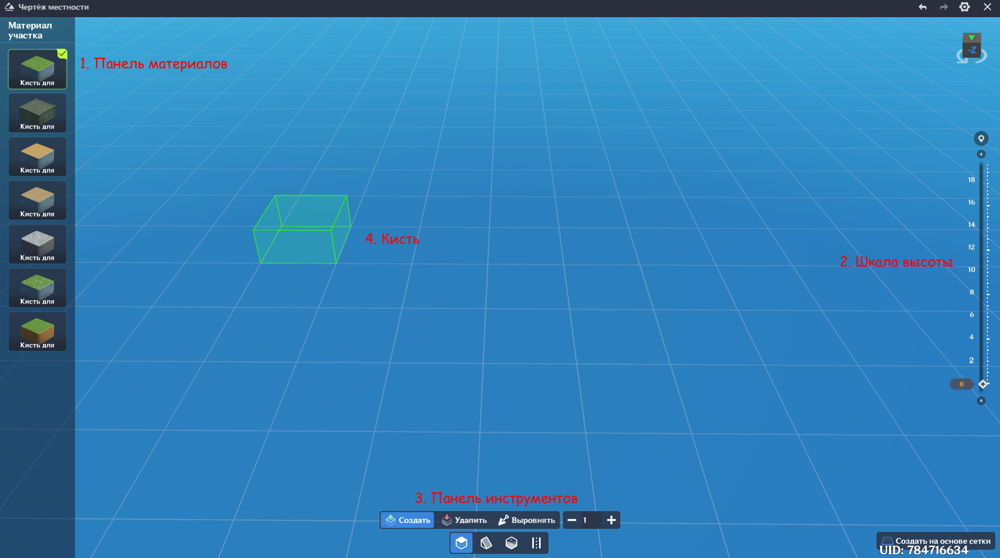

# Редактирование ландшафта

Используйте Редактирование ландшафта для создания необходимой обстановки на уровне.

## I. Редактирование ландшафта

### 1. Точка входа

Откройте Редактирование ландшафта нажатием на первую кнопку верхней панели внутри рабочей области.

### 2. Начальное состояние

При создании уровня на координатах (0,0,0) автоматически генерируется плоский ландшафт размером 100х100.

### 3. Единица редактирования

В Редактировании ландшафта минимальной единицей редактирования является однослойный участок размером 5х5 (высота слоя - 2.5).

### 4. Рабочая область

#### (1) Панель ресурсов

Как открыть: нажмите на кнопку . Повторное нажатие на кнопку закроет панель.

Функция: Выбор ресурсов для размещения.

Список ресурсов:

  * [Материал участка](#terrain-modification-free-edit)

  * Конфигурация окружения (настройки освещения, времени суток и погоды)

  * Настраиваемые компоненты (созданные пользователем)

  * Предустановленные компоненты (идут в комплекте с редактором) 

  * Библиотека ресурсов 

#### (2) Управление ландшафтом

Как открыть: нажмите на кнопку . Повторное нажатие на кнопку закроет панель.

Функция: управление ландшафтами на уровне.

Список ландшафтов:

Функции:

  * Переименование (дважды кликните по имени ландшафта ) - изменение имени выбранного ландшафта.

  * Фокус (кликните на кнопку ) - фокусирует камеру на выбранном ландшафте.

  * Создание ландшафта (нажмите на кнопку ).

Детали ландшафта:

Для активации выберите любой ландшафт на уровне (не работает с множественным выбором).

Функции:

  * Изменение расположения ландшафта (ручной ввод) - координаты по осям X, Y и Z.

  * Поворот ландшафта (ручной ввод) - угол поворота по оси Y.

  * Смена материала (нажмите на кнопку ) - заменить материал ландшафта или удалить его (подробнее см. [ниже](#terrain-creation)).

    !!! Warning "Важно!"

        Нажатие на кнопку  удаляет все участки на ландшафте, покрытые материалом.  

#### (3) Указатель

Указатель активен всегда за исключением режима редактирования.

Функция: выбор одного или нескольких объектов. Содержимое панелей рабочей области меняется в зависимости от выбранных объектов.

С помощью указателя можно редактировать:

  * Ландшафт (подробнее см. [далее](#terrain-modification-pointer))

  * Статические и динамические объекты, создания

## II. Создание ландшафта { id="terrain-creation" }

### 1. Активация

  * Панель ресурсов

    После перехода к [модификации ландшафта](#terrain-modification-free-edit) нажмите на кнопку **Создать на основе сетки** в нижнем правом углу рабочей области.

  * Панель деталей

    На рабочей области перейдите в **Управление ландшафтом** > **Список ландшафтов** > **Создать ландшафт**.

### 2. Режим создания

### 3. Логика создания

Выберите материал на Панели ресурсов, настройте высоту размещения на шкале с правой стороны рабочей области и режим рисования на нижней панели, затем с помощью курсора мыши нарисуйте ландшафт. Нажмите на кнопку **Завершить рисование** в верхнем правом углу, чтобы сгенерировать ландшафт из нанесённого на уровень содержимого.

### 4. Доступные функции

#### (1) Материал участка

Функция:

  * Переключение материала кисти: щёлкните, чтобы выбрать один из семи доступных материалов ландшафта.

#### (2) Шкала высоты

Функция: управление высотой размещения ландшафта.

  * Перемещайте слайдер  для изменения высоты размещения ландшафта.

  * Щёлкните по значению высоты слайдера , чтобы изменить его.

  * Нажмите на кнопку , чтобы сфокусировать камеру на выбранной высоте.

  * Кликом на кнопки  сверху и снизу слайдера увеличивайте и уменьшайте высоту на 20. Зажимайте кнопки, чтобы прокручивать слайдер в выбранном направлении.

#### (3) Панель инструментов

Функция: переключение режимов кисти.

  * Действия над участком

    

    * Слои кисти: установите количество слоёв, затрагиваемое кистью за раз. При значении 5 за раз будут рисоваться и стираться по 5 слоёв ландшафта вглубь.

    * Создать: возвысить выбранную область на заданное количество слоёв

        !!! Note "Обратите внимание"
            После редактирования вся "стопка" ландшафта (слои от верхнего до нижнего на участке) примет вид текущего материала. Иными словами, создать "сэндвич" из нескольких меняющихся материалов ландшафта - невозможно.

    * Удалить: понизить выбранную область на заданное количество слоёв.

    * Выровнять: подстроить высоту участка под выбранную высоту.

  * Действия над наклонными поверхностями

    

    Наклонная поверхность может быть создана только на плоской поверхности и только одним слоем. Материал такой поверхности зависит от выбора на Панели материалов.

    * Направление: задать направление наклонной поверхности - прямо / влево (по часовой стрелке) / вправо (против часовой стрелки).

    * Создать: разместить наклонную поверхность. Стрелки, появляющиеся при размещении, позволяют выбрать направление поверхности.

    * Удалить: удалить выбранную наклонную поверхность.

  * Действия над водоёмами

    

    Водоём может быть создан только на плоской поверхности и только одним слоем.

      * Создать: преобразовать верхний слой выбранного участка в водоём.

      * Удалить: преобразовать выбранный водоём в плоскую поверхность.

  * Действия над путями

    

    Путь (дорога, тропинка) может быть создан только на плоской поверхности.

      * Создать: разместить путь на верхней части выбранного участка.

      * Удалить: удалить путь с верхней части выбранного участка.

#### (4) Действия с кистями

  * Нажатие ЛКМ: применить эффект кисти к выбранному участку единожды.

  * Перемещение курсора при зажатой ЛКМ: применить эффект кисти к каждому подходящему участку на пути следования курсора.

#### (5) Завершить рисование

Функция: генерация ландшафта из созданного на уровне содержимого.

Ландшафты будут сформированы по принципу объединения прилегающих участков. Если какие-то участки, например, находятся в воздухе, то они сформируют ландшафт или ландшафты, отдельные от расположенного на 0 высоте.
